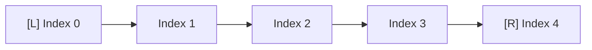

# Arrays and Strings: Core Foundation

## Mental Model
Arrays and Strings are contiguous blocks of memory. 

## Key Patterns
- **Two Pointers:** Moving from both ends towards the center (e.g., reversing, palindromes).
- **Sliding Window:** Maintaining a window of elements to find subarrays/substrings.
- **Prefix Sum / Hashing:** Precomputing sums or using maps for $O(1)$ lookups.

## Visualizing Two Pointers

