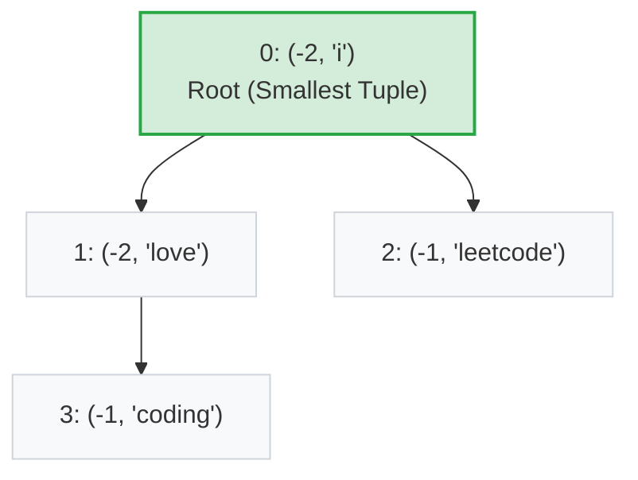
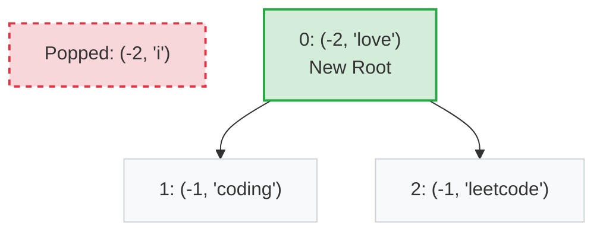
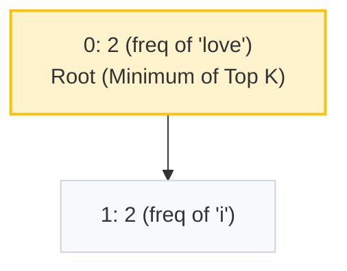

# Visualizing Heaps: Top K Frequent Words

Let's use the exact example from your code: `words = ["i", "love", "leetcode", "i", "love", "coding"]` and `k = 2`.

First, we count the frequencies:
*   `"i"`: 2
*   `"love"`: 2
*   `"leetcode"`: 1
*   `"coding"`: 1

A Heap is conceptually a **Binary Tree**, but it is stored in memory as a flat **Array**. 

---

## 1. The MaxHeap Approach (What your code does)

Python only has a built-in **MinHeap** (`heapq`). To simulate a **MaxHeap** so the most frequent elements pop out first, your code ingeniously pushes *negative* frequencies: `(-freq, word)`.

When Python compares two tuples, it compares the first element (`-freq`). If they tie, it compares the second (`word` alphabetically).
*   `-2` is smaller than `-1` (so freq 2 pops before freq 1).
*   `"i"` is smaller than `"love"` (so "i" pops before "love").

### Inserting into the Heap

As we push these tuples into the array `maxHeap = []`, Python constantly re-arranges them so the "smallest" tuple (highest frequency, earliest alphabetically) floats to the top (index 0).

**Array Representation in Memory:**
`[ (-2, 'i'), (-2, 'love'), (-1, 'leetcode'), (-1, 'coding') ]`

*(Notice how index `0` is the root. Its left child is at index `1`, right child at index `2`. Child of `1` is at `3`)*

### Popping the Top K (k=2)

**Pop 1:** `heapq.heappop(maxHeap)` 
The root `(-2, 'i')` is removed. Python grabs the last element `(-1, 'coding')`, puts it at the root, and lets it "bubble down" to its correct spot.

**Pop 2:** `heapq.heappop(maxHeap)`
The new root `(-2, 'love')` is removed. 

**Final Result:** `["i", "love"]`

**Time Complexity:** $O(N \log N)$ because we push all $N$ elements into the heap.

---

## 2. The MinHeap Approach (The Optimized $O(N \log K)$ Way)

Instead of putting *all* words into a MaxHeap, what if we maintain a **MinHeap of strictly size `k`**? 

We iterate through the words. If the heap exceeds size `k`, we pop the "smallest" element (which, in a MinHeap, is the lowest frequency element we *don't* want).

To keep the *highest* frequencies in the heap, we push positive frequencies.
*Wait, there's a catch for words:* If frequencies tie, we want to pop the *alphabetically later* word so we keep the earlier one. So we actually push `(freq, -word)`. Since we can't negate a string in Python, we usually write a custom wrapper class.

But assuming a simple number problem (like "Top K Frequent Elements" with just integers), the MinHeap tree looks like this when keeping size `k=2`:

### Inserting elements (keeping size k=2)

1. Push 2 (freq of "i")
2. Push 2 (freq of "love")
3. Push 1 (freq of "leetcode") -> Size is 3. Pop the minimum (1).
4. Push 1 (freq of "coding") -> Size is 3. Pop the minimum (1).

**Array Representation:**
`[ 2, 2 ]`

### Why MinHeap is better for Top K:
Because we cap the heap size at `K`, every push/pop operation takes $O(\log K)$ time instead of $O(\log N)$. 
*   **MaxHeap Total Time:** $O(N \log N)$
*   **MinHeap Total Time:** $O(N \log K)$

When $N$ is 1,000,000 and $K$ is 5, the MinHeap approach is massively faster!
