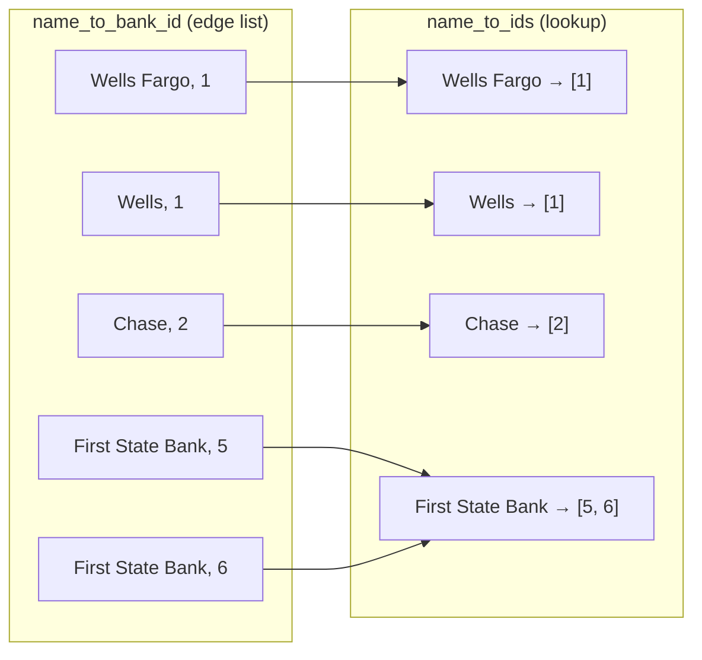
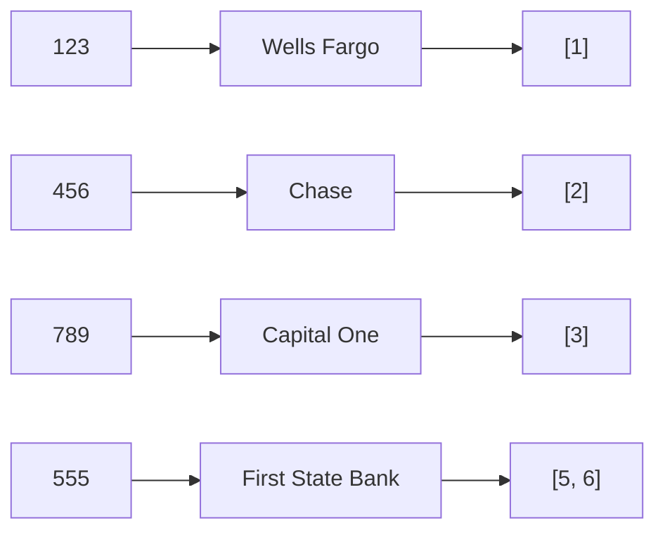
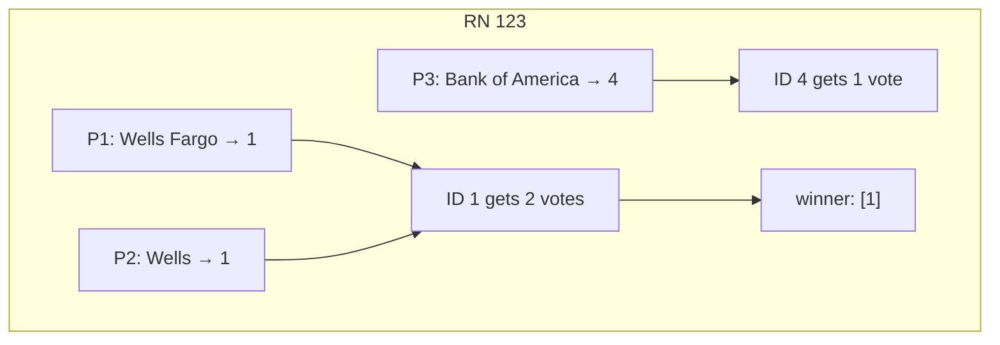
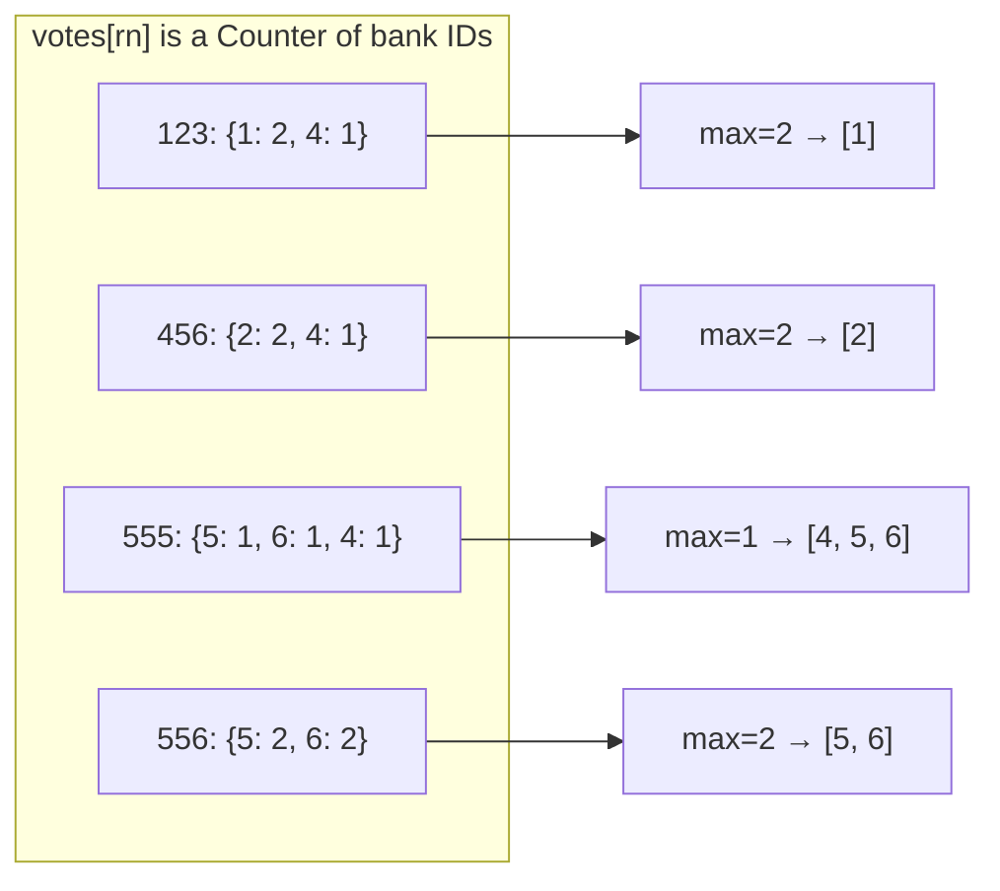

# Pattern: Invert → Join → Vote

Plaid-style mapping: routing numbers → noisy names → internal bank IDs.

```
  routing number  ──lookup──►  name  ──lookup──►  [bank IDs]
       "123"              "Wells Fargo"              [1]
```

Names are **not unique**. Invert the name table first, then join. When providers disagree, vote on **IDs**, not names.

---

## What they are testing

| Skill | What they want to hear |
|---|---|
| Many-to-many | One bank, many names. One name, many banks. Output is a **list**. |
| Invert then join | Don't scan `name_to_bank_id` for every RN. Build `name → [ids]` once. |
| Entity resolution | `"Wells"` and `"Wells Fargo"` are aliases of the same ID. Vote on IDs. |
| Ambiguity | `"First State Bank"` → `[5, 6]`. Don't pretend you know which one. |

---

## Data (keep this picture in your head)

```
rn_to_name                          name_to_bank_id
─────────                           ────────────────
123 → Wells Fargo                   Wells Fargo  ──►  1
456 → Chase                         Wells        ──►  1     ← alias of same bank
789 → Capital One                   Chase        ──►  2
555 → First State Bank              Capital One  ──►  3
                                    Bank of America ►  4
                                    First State Bank ►  5
                                    First State Bank ►  6   ← two banks, one name
```

---

## Part 1 — Invert, then join

### Step A: invert the edge list

`name_to_bank_id` is a list of edges. Flip it into an adjacency list.



One pass. Dedup IDs with a `set`.

### Step B: join each routing number through its name



Unknown name → `[]`. Never crash.

**Result**

```
{
  "123": [1],
  "456": [2],
  "789": [3],
  "555": [5, 6],
}
```

**Say this:** *"I invert names into a dict of sets so lookup is O(1), then join. 555 stays a list because the name is ambiguous."*

**Complexity:** invert O(N), join O(R). Space O(N).  
N = rows in `name_to_bank_id`, R = routing numbers.

---

## Part 2 — Providers disagree. Vote on IDs.

Three providers, same routing numbers, different names:

```
           Provider 1         Provider 2            Provider 3
123        Wells Fargo        Wells                 Bank of America
456        Chase              Bank of America       Chase
555        First State Bank   Bank of America       —
556        First State Bank   First State Bank      —
789        —                  Capital One           —
```

### Trap: voting on names

```
123:  Wells Fargo=1, Wells=1, Bank of America=1
      three-way tie  →  [1, 4]     WRONG
```

`"Wells Fargo"` and `"Wells"` are the **same bank**. Name-vote cannot see that.

### Correct: expand name → IDs, then vote

Each provider casts one vote per ID that its name maps to.



```
123:  1 → 2 votes,  4 → 1 vote     →  [1]        aliases merged
456:  2 → 2 votes,  4 → 1 vote     →  [2]
555:  5 → 1,  6 → 1,  4 → 1        →  [4, 5, 6]  real 3-way tie
556:  5 → 2,  6 → 2                →  [5, 6]     name agreed, still 2 banks
789:  3 → 1                        →  [3]
```



**Say this:** *"I vote on bank IDs so aliases combine. Ties stay a list — the data does not support a unique answer."*

---

## Interview skeleton (type this)

```
1. invert  name → set(ids)
2. Part 1  for each rn:  lookup name → list(ids)
3. Part 2  for each provider, for each rn:
              for each id of that name:  votes[rn][id] += 1
           keep ids with max count
```

Clarifying questions (ask before coding, 30 seconds):

1. Unknown name → empty list?
2. Duplicate `(name, id)` rows — dedup?
3. Output IDs sorted? (yes, deterministic)
4. Ties — return all winners, or require strict majority?

If they ask "how else would you break ties?":

- Require `count > num_providers / 2` (majority). 555 would be unknown.
- Weight providers (Fed > aggregator > scrape).
- Prefer IDs that came from an **unambiguous** name (name maps to exactly one ID).
- Normalize names (`strip`, `lower`) before lookup.

Do **not** overbuild. Plurality on IDs is the answer they want.

---

## Why this pattern shows up

Same shape as:

- SQL join + `GROUP BY`
- inverted index (word → docs)
- entity resolution (noisy labels → canonical id)

Canonical key is the bank ID. The name is a dirty foreign key.
